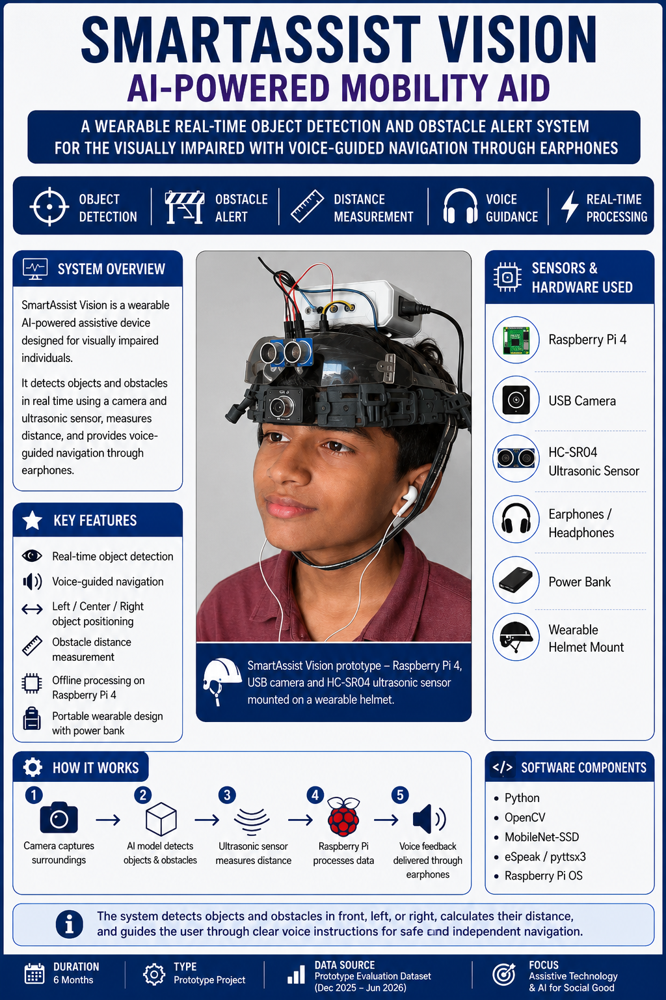
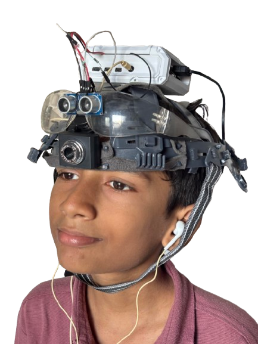
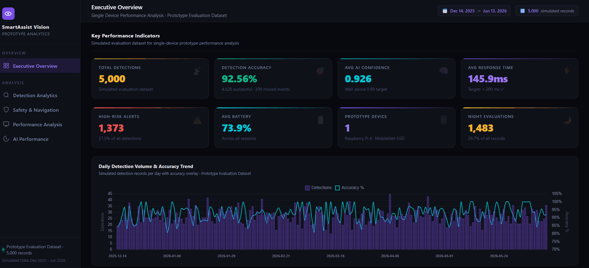

# SmartAssist Vision — AI-Powered Mobility Aid

### Data Analysis & Performance Evaluation Dashboard


---

## 🌐 Live Dashboard

🔗 **Interactive Dashboard:**  
https://fardinsk25.github.io/SmartAssist_Vision_Data_Analysis/

---

## 📊 Dashboard Preview

<p align="center">
  
</p>

---

## 📌 Project Overview

SmartAssist Vision is an AI-powered wearable mobility aid designed to assist visually impaired individuals through real-time object detection, obstacle awareness, distance estimation, and voice-guided navigation.

The system combines:

- MobileNet-SSD Object Detection
- Raspberry Pi 4 Model B
- HC-SR04 Ultrasonic Sensor
- Voice Navigation using eSpeak / pyttsx3

This repository focuses on the **performance evaluation and analytics** of the prototype using a simulated evaluation dataset containing 5,000 detection records.

The project demonstrates how data analytics can be used to evaluate AI system performance through detection accuracy, confidence analysis, response time monitoring, safety metrics, and operational insights.

---

## 🎯 Key Project Metrics

| Metric | Value |
|----------|----------|
| Total Detection Records | 5,000 |
| Detection Accuracy | 92.56% |
| Average AI Confidence | 0.926 |
| Average Response Time | 145.9 ms |
| High-Risk Alerts | 1,373 |
| Average Battery Level | 73.9% |
| Very Close Detections | 1,500 |
| Night Evaluations | 1,483 |
| Prototype Device | Raspberry Pi 4 + MobileNet-SSD |

---

## 🖼️ Project Poster

<p align="center">
  
</p>

---

## 🖼️ Prototype

<p align="center">
  
</p>

<p align="center">
<i>Wearable prototype featuring Raspberry Pi 4, USB camera, ultrasonic sensor, and earphone-based voice guidance.</i>
</p>

---

# 📊 Dashboard Walkthrough

## Executive Overview

<p align="center">
  
</p>

### Highlights

- KPI Monitoring
- Detection Accuracy Tracking
- Monthly Performance Trends
- Response Time Analysis
- Battery Monitoring

---

## Detection Analytics

<p align="center">
  
</p>

### Highlights

- Object Detection Distribution
- Detection Status Analysis
- Position Classification
- Distance Category Breakdown
- Environment-Based Performance

---

## AI Performance Analysis

<p align="center">
  
</p>

### Highlights

- Confidence Distribution
- Confidence by Object Class
- Monthly Confidence Trends
- Response Time Stability
- Model Reliability Analysis

---

## Performance Analysis

<p align="center">
  
</p>

### Highlights

- Scenario-Based Evaluation
- Detection Accuracy Comparison
- Battery Performance Analysis
- Response Time Tracking
- Performance Matrix

---

# 🔍 Analysis Highlights

### Detection Accuracy

- Accuracy improved from 91.6% to 94.4% across the evaluation period.
- Daily accuracy remained consistently above 85%.
- Person was the most frequently detected object.

### AI Confidence

- Average confidence score reached 0.926.
- More than 55% of detections exceeded 0.95 confidence.
- Day and night performance remained highly consistent.

### Safety & Navigation

- 30% of detections were classified as Very Close (<50 cm).
- Person and Dog generated the highest number of High-Risk alerts.
- Distance-based alert generation remained stable throughout evaluation.

### Response Time

- Average response time was 145.9 ms.
- Performance remained comfortably below the 200 ms target threshold.
- Response times were consistent across all scenario groups.

---

# 🛠️ Technology Stack

## Analytics

- Python
- Pandas
- Matplotlib
- Seaborn
- Jupyter Notebook

## Dashboard

- HTML
- CSS
- JavaScript
- Chart.js

## AI & Computer Vision

- MobileNet-SSD
- OpenCV
- Raspberry Pi 4
- HC-SR04 Ultrasonic Sensor
- eSpeak / pyttsx3

---

# 🗂️ Repository Structure

```text
SmartAssist_Vision_Data_Analysis
│
├── assets/
├── data/
├── notebook/
├── scripts/
│
├── index.html
├── README.md
├── requirements.txt
├── .gitignore
└── LICENSE
```

---

# 🚀 Getting Started

### View Dashboard Online

Visit:

https://fardinsk25.github.io/SmartAssist_Vision_Data_Analysis/

### Run Locally

Clone the repository:

```bash
git clone https://github.com/YOUR_USERNAME/SmartAssist_Vision_Data_Analysis.git
```

Install dependencies:

```bash
pip install -r requirements.txt
```

Open:

```text
index.html
```

in any modern browser.

---

# 🔮 Future Enhancements

- YOLOv8 Integration
- Edge TPU Acceleration
- GPS-Assisted Navigation
- Mobile Application Integration
- Real-Time Cloud Monitoring
- Live Performance Analytics

---

# 📄 License

This project is licensed under the MIT License.

---

# 📬 Connect

### Fardin Imran Shaikh

Data Analytics • AI • IoT • Computer Vision

🌐 Portfolio: https://fardinsk25.github.io/portfolio/

💼 LinkedIn: https://www.linkedin.com/in/fardinshaikh02/

🔗 Live Dashboard:  
https://fardinsk25.github.io/SmartAssist_Vision_Data_Analysis/

🐙 GitHub:  
https://github.com/fardinsk25

---

⭐ If you found this project interesting, consider giving the repository a star.
